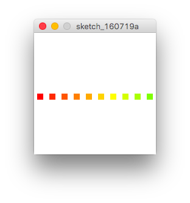
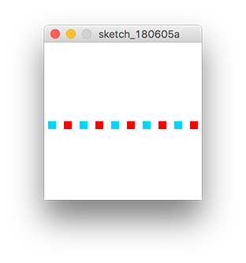
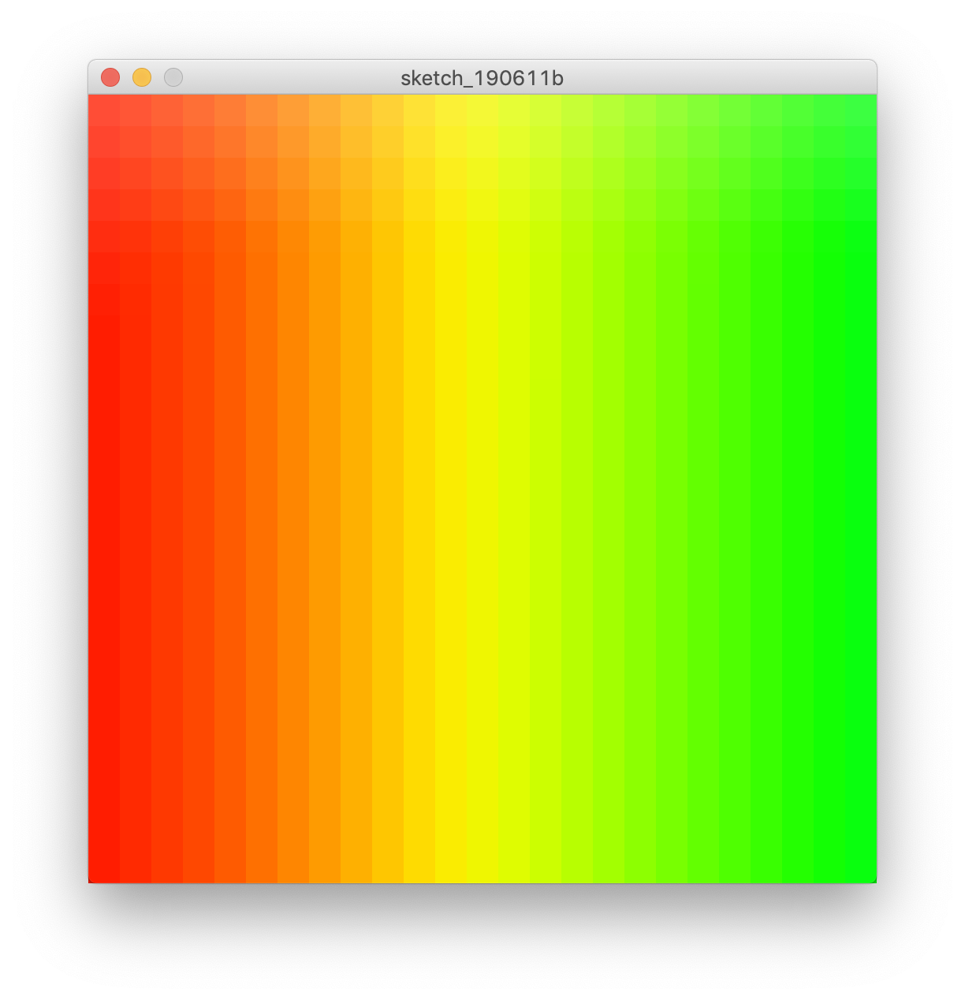

# ループ

## for文

反復作業を正確にすばやく実行する


### for文の記法

```
for (初期化; 条件; 更新 ){
	文
}

```

&nbsp;


### for文を使ってグラーデーションを表現

```
void setup(){
	size(200,200);
	background(255);
	colorMode(HSB,360,100,100);
	noStroke();
	// 初期値0、10未満まで、1ずつ増える
	for(int i=0; i<10; i++){
	  fill(i*10, 100, 100);
	  rect(i*20+5, width/2, 10, 10);
	}
}
```



&nbsp;

### forとifの組み合わせ


```
void setup(){
  size(200,200);
  background(255);
  colorMode(HSB,360,100,100);
  noStroke();
  // 初期値0、10未満まで、1ずつ増える
  for(int i=0; i<10; i++){
    fill(10, 100, 100);
    if(i % 2 == 0){
      // 変数iを2で割った余りが0なら
      fill(190, 100, 100);
    } else {
      fill(10, 100, 100);
    }
    rect(i*20+5,width/2,10,10);
  }
}
```


&nbsp;


### for文とランダム

```
void setup(){
  size(500,500);
  background(255);
  noFill();
  stroke(0);
  for(int i=0; i<200; i++){
    line(random(0,width),random(0,height),random(0,width),random(0,height));
  }
}
```


&nbsp;


### forの入れ子


```
void setup(){
	size(200,200);
	background(255);
	colorMode(HSB,360,100,100);
	noStroke();
	// 初期値0、10未満まで、1ずつ増える
	for(int y=0; y < 10; y++){
	  // 初期値0、10未満まで、1ずつ増えるs
	  for(int x=0; x < 10; x++){
	    fill(x*10, 10+ y*10, 100);
	    rect(x*20+5,y*20+5,10,10);
	  }
	}
}
```


&nbsp;
&nbsp;

### forとインタラクティブ1

```
void setup(){
    size(500,500);
    background(255);
    colorMode(HSB,360,100,100);
}

void draw(){
  noStroke();
    // 初期値0、10未満まで、1ずつ増える
    for(int y=0; y < height; y+=20){
      // 初期値0、10未満まで、1ずつ増える
      for(int x=0; x < width; x+=20){
        // fill(x*10, 10+ y*10, 100);
        // int hue = (int) map(mouseX,0,width,0,36);
        int hue = (int) map(mouseX,0,width,1,180);
        int sat = (int) map(mouseY,0,height,100,10);
        fill(hue + (x/4), sat + (y/4),100,100);
        rect(x,y,100,100);
      }
    }
}
```




&nbsp;
&nbsp;

### forとインタラクティブ2

```
void setup() {
    size(500,500);
    noStroke();
    fill(0);
    
    //距離を測る
    // float x = dist(0,0,50,50);
    // println("x: "+x);
}

void draw() {
    background(255);

    for (int y = 0; y < width; y+=20) {
        for (int x = 0; x< height; x+=20) {
            //マウス座標とXY座標の距離を保存
            float mouseDistance = dist(x,y,mouseX,mouseY);
            ellipse(x, y, mouseDistance*0.1, mouseDistance*0.1);
        }
    }
}

```


&nbsp;
&nbsp;


